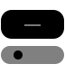
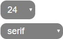

# Web Canvas

## How to use 

 
**Tool Not Selected**  

**Tool Selected**

## Functions

 
### Upload
Upload image to canvs

 
### Download
Download the image you draw

 
### Undo
Undo the step

 
### Redo
Redo the step

 
### Reset
Reset the canvas

 
### Brush Style
Change Brush Color and Size
    
 
### Brush
Brush your canvas

 
### Eraser
Erase your paint

 
### Line
To make Straight Line

 
### Circle
To make a Circle

 
### Triangle
To make a Triangle

 
### Rectangle
To make a Rectangle

 
### Text
Allows to type Text on the canvas

 
### Text Style
Change Text Size and Font Style

### Gitlab page link

    https://106010018.gitlab.io/AS_01_WebCanvas

